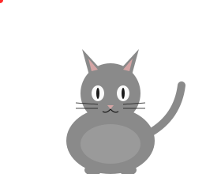
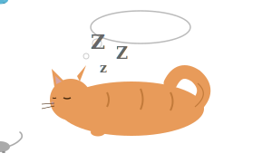

<p align="center">
  
</p>

# meowmeow

**`/meow`** : a short skeptical challenge for claude code. same trigger, four meanings.

meow.

## what it does

one slash command. `model: sonnet`. reads your previous response and infers which meow this is.

- **interrogative.** "really?" but for an LLM. challenge a claim you just made.
- **continuation.** you stopped mid-thought. pick up where you left off.
- **retry.** that missed. try again, differently.
- **proceed.** stop asking, pick one, commit.

skepticism is not new information. the command will not let the model flip a correct position just because the user pushed back. epistemic cowardice is a named anti-target.

<p align="center">
  
</p>

## install

personal (all projects):

```bash
mkdir -p ~/.claude/commands
cp meow.md ~/.claude/commands/
```

project-scoped:

```bash
mkdir -p .claude/commands
cp meow.md .claude/commands/
```

restart claude code, type `/`, `/meow` should show up.

## why cats

cats meow at humans, not at each other. same sound, a dozen meanings: hungry, annoyed, bored, curious, lonely, affectionate. the human fills in the meaning from what just happened.

`/meow` is built the same way. same trigger, different meaning per context. it reads the shape of your last response to decide which meow this is. context over text.

## philosophy

- **calibrated confidence.** "sure about X, unsure about Y because Z." no false certainty, no reflexive hedging.
- **no performance.** skip "great question!" and "you're absolutely right!" just do the work.
- **epistemic courage.** don't flip a correct answer because someone frowned at it. ask why first.
- **one-sentence test.** if the pushback reduces to one sentence, answer in one sentence.

<p align="center">
  
</p>

## status

theory-complete. `/meow` went through three rewrites in one session. not yet used in anger. open an issue if you find a gap. prs welcome, `/meow` at me.

## license

MIT. see [LICENSE](LICENSE).
