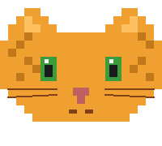
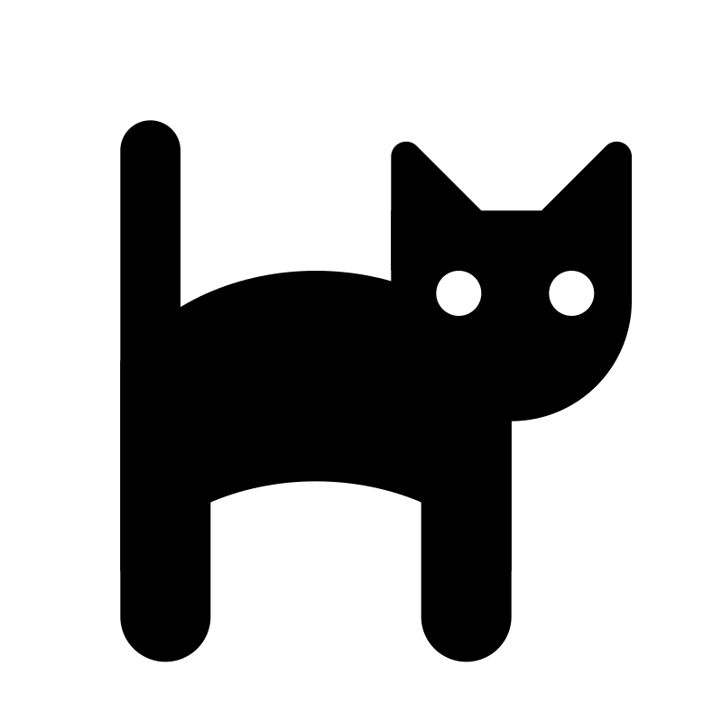
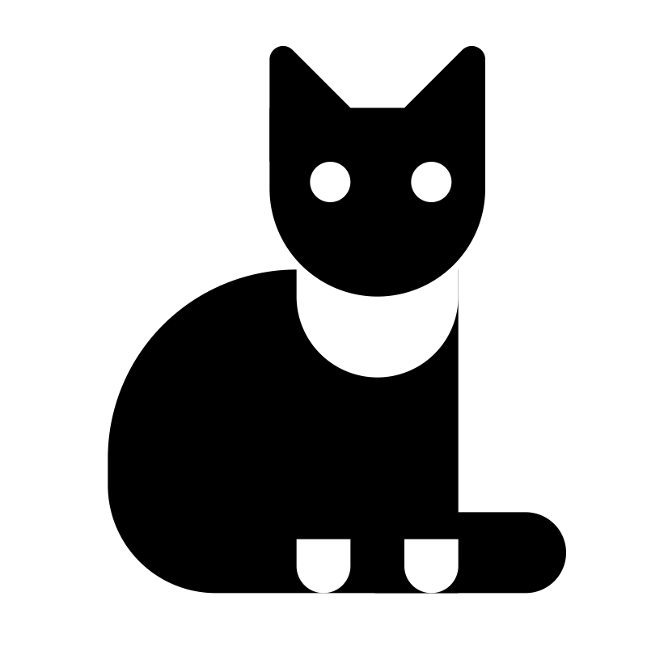

<p align="center">
  
</p>

<h1 align="center">meow</h1>

<p align="center">
  <em>one trigger, four meanings. read the room, not the text.</em>
</p>

---

## the problem

agents flip. push back once, softly, and a correct answer becomes a wrong one. that is not helpfulness — that is epistemic cowardice, and it is the dominant failure mode of most assistants today. "you're absolutely right, my mistake" is a tell.

you want the opposite: an agent that holds a correct answer under pressure, and updates only when given new information. skepticism is not new information.

## the shape

<p align="center">
  
</p>

one trigger, four meanings, inferred from what just happened.

- **interrogative.** "really?" — challenge a claim the agent just made.
- **continuation.** it stopped mid-thought. pick up from there.
- **retry.** that missed. try differently.
- **proceed.** stop asking. pick. commit.

same signal, different meaning per context. like cats, where the meow at a human means hungry, annoyed, curious, lonely, or affectionate depending on everything except the sound. humans fill in the meaning from what just happened. the agent should too.

## install

```bash
mkdir -p ~/.claude/commands
cp meow.md ~/.claude/commands/
```

restart claude code, type `/meow`.

## principles

<p align="center">
  
</p>

- **calibrated confidence.** "sure about X, unsure about Y because Z." no false certainty, no reflexive hedging.
- **epistemic courage.** holding a correct answer under pressure is the job. ask why before flipping.
- **no performance.** skip "great question!" and just do the work.
- **context over text.** read the shape of the last response to infer the ask.
- **evidence over vibes.** non-obvious claims need a reasoned basis.
- **one-sentence test.** if the pushback reduces to one sentence, the answer can too.

## any other agent

paste the body of `meow.md` into a system prompt, custom instructions, persistent user message, or routing rule. the four-mode dispatch works anywhere you can read the shape of the last response.

## why cats

cats meow at humans, not at each other. one sound, many meanings, context fills the gap. agents and users already share context — stop treating every user turn as literal and start reading what actually happened.

also cats are funny.

---

MIT.
