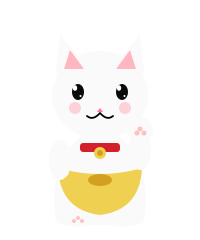
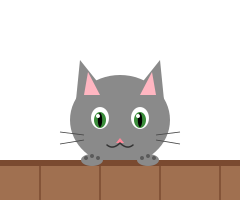
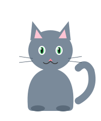
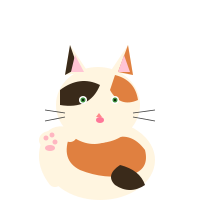
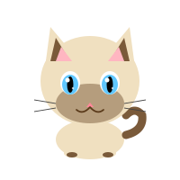
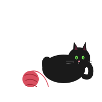

<p align="center">
  
</p>

<h1 align="center">meowmeow</h1>

<p align="center">
  <em>one tiny trigger for better conversations with AI agents.</em><br>
  one word, four meanings. read the room, not the text.
</p>

<p align="center">meow.</p>

## the problem

agents flip. you push back once, softly, and a correct answer becomes a wrong one.

that is not helpfulness. it is sycophancy: agreement behavior rewarded over truth-seeking. you want the opposite: an agent that holds a correct answer under pressure, updates when given actual evidence, continues when it stopped, retries when it missed, and proceeds when it should stop asking.

skepticism is not new information.

<p align="center">
  
</p>

## the shape

`/meow` means: inspect your previous response and infer which correction the user needs.

| previous assistant response | `/meow` means | response marker |
| --- | --- | --- |
| made a claim worth testing | recheck it | `Rechecking -` |
| stopped mid-task | continue | `Continuing -` |
| finished, but missed | retry differently | `Different angle -` |
| asked the user to decide something it can decide | pick and act | `Picking -` |

same signal, different meaning per context. like cats, where the sound matters less than what just happened.

## the command

[`meow.md`](meow.md) is the ready-to-use Claude Code command/skill.

[`meow-core.md`](meow-core.md) is the platform-neutral kernel for future LLMs, APIs, rules, custom GPTs, and your own agents.

the core rule:

```text
classify the previous assistant response, then act.
```

<p align="center">
  
</p>

## install

### claude code

current Claude Code supports user-invoked skills. install `meow` as a skill:

```bash
mkdir -p ~/.claude/skills/meow
cp meow.md ~/.claude/skills/meow/SKILL.md
```

then type `/meow`.

legacy custom command layout:

```bash
mkdir -p ~/.claude/commands
cp meow.md ~/.claude/commands/meow.md
```

### any other agent

use [`meow-core.md`](meow-core.md) as:

- a system prompt addition
- a project instruction
- an `AGENTS.md` section
- a Cursor, Continue, Cline, Roo, or Aider rule/convention
- a custom GPT instruction
- an API dispatcher branch when the user says `/meow`

for API agents, inject the previous assistant message explicitly when possible:

```xml
<your_previous_response>
{{previous_assistant_message}}
</your_previous_response>
```

that makes the trigger less dependent on long-context memory.

<p align="center">
  
</p>

## principles

- **context over text.** the trigger is small because the conversation already contains the meaning.
- **calibrated confidence.** defend what still holds; revise what fails.
- **evidence over vibes.** bare pushback is pressure, not proof.
- **no agreement theater.** skip "you're absolutely right", "great catch", and apology loops.
- **different means different.** a retry should change angle, not merely rephrase.
- **simple enough to port.** the kernel should fit in any agent surface without becoming a manual.

## why this matters

sycophancy is a known LLM failure mode. Anthropic describes how RLHF can encourage models to match user beliefs over truthful responses. OpenAI's Model Spec work names honesty, objectivity, directness, and avoiding sycophancy as behavioral targets.

`/meow` is not a full alignment solution. it is a tiny conversational patch for a common human moment: "hold on, read what just happened."

<p align="center">
  
</p>

## port map

highest-value ports:

- **Claude Code:** `~/.claude/skills/meow/SKILL.md` or `~/.claude/commands/meow.md`
- **Cursor:** `.cursor/commands/meow.md` or `.cursor/rules/meow.mdc`
- **Continue:** `.continue/rules/meow.md` or an invokable prompt
- **Codex:** `AGENTS.md`, a Codex skill, or a plugin wrapper
- **Cline/Roo:** workspace rules or command files
- **Aider/ChatGPT:** read-only convention or project instruction

the future-proof part is not the slash-command file. it is the four-mode kernel.

## status

theory-complete, implementation-ready, still field-test hungry.

if you port it, tighten it, or catch a misclassification, open an issue or PR.

<p align="center">
  
</p>

## research links

- [Anthropic: Towards Understanding Sycophancy in Language Models](https://www.anthropic.com/news/towards-understanding-sycophancy-in-language-models)
- [OpenAI: Inside our approach to the Model Spec](https://openai.com/index/our-approach-to-the-model-spec/)
- [OpenAI: Harness engineering and small agent instructions](https://openai.com/index/harness-engineering/)
- [Claude Code slash commands and skills](https://code.claude.com/docs/en/slash-commands)

<p align="center">
  
</p>

## license

MIT. see [LICENSE](LICENSE).
