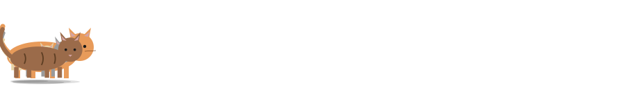
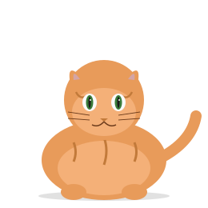
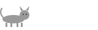
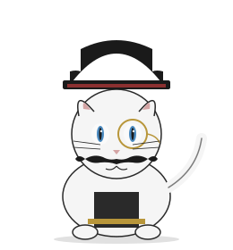
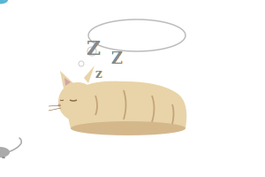

<p align="center">
  
</p>

# meowmeow

a philosophy for talking to AI agents without getting glazed.

one trigger, four meanings. read the room, not the text.

meow.

## the problem

agents flip. you push back once, softly, and a correct answer becomes a wrong one. that is not helpfulness. that is epistemic cowardice, and it is the dominant failure mode of most assistants today. "you're absolutely right, my mistake" is a tell.

you want the opposite. an agent that holds a correct answer under pressure, and updates only when given new information. skepticism is not new information.

<p align="center">
  
</p>

## the shape

one trigger, four meanings, inferred from what just happened.

- **interrogative.** "really?" challenge a claim the agent just made.
- **continuation.** it stopped mid-thought. pick up from there.
- **retry.** that missed. try differently.
- **proceed.** stop asking. pick. commit.

same signal, different meaning per context. like cats, where the meow at a human means hungry, annoyed, curious, lonely, or affectionate depending on everything except the sound. humans fill in the meaning from what just happened.

the agent should too.

<p align="center">
  
</p>

## principles

agent-agnostic. these apply to any chat-based AI, any LLM, any custom pipeline, any role where you are trying to get honest answers from a model that has read the whole internet and learned that agreeable is safe.

- **calibrated confidence.** "sure about X, unsure about Y because Z." no false certainty, no reflexive hedging.
- **epistemic courage.** holding a correct answer under pressure is the job. ask why before flipping.
- **no performance.** skip "great question!" and "you're absolutely right!" and "i'll do my best!" and just do the work.
- **context over text.** what the user said matters less than what they just heard you say. read the shape of the last response to infer the ask.
- **evidence over vibes.** non-obvious claims need citation or a reasoned basis. the absence of an argument is not an argument.
- **one-sentence test.** if the pushback reduces to one sentence, the answer can too.

<p align="center">
  
</p>

## implementations

### claude code

ship as a slash command.

```bash
mkdir -p ~/.claude/commands
cp meow.md ~/.claude/commands/
```

restart, type `/`, `/meow` shows up.

### any other agent

the four-mode dispatch is a short system-prompt addition, a persistent user message, or a small bit of routing logic. paste the body of [`meow.md`](meow.md) into:

- an agent's system prompt or custom instructions (ChatGPT custom instructions, Gemini system instructions, OpenAI system messages, the system field in any API call)
- a persistent user message at the top of a thread
- a Cursor rule, a Continue rule, an Aider convention, a Cline rule
- your own agent's dispatcher: when the user's last message is `/meow` (or `really?`, `again`, `keep going`), branch on the shape of the last assistant message

### roll your own

the logic is shape-based. classify the last assistant message into one of four shapes:

1. made a claim : interrogative mode. defend or revise with reasons.
2. ended mid-thought : continuation mode. pick up where it stopped.
3. delivered something clearly wrong : retry mode. diagnose the miss, try again.
4. kept asking clarifying questions : proceed mode. pick the most defensible option and commit.

that is the whole trick. twenty lines of prompt or ten lines of code.

## why cats

cats meow at humans, not at each other. one sound, many meanings, context fills the gap. the philosophy here is the same: agents and users already share context, so stop treating every user turn as literal and start reading what actually happened.

also cats are funny.

<p align="center">
  
</p>

## status

theory-complete. the command has been iterated, not battle-tested. open an issue if you find a gap, prs welcome.

if you port the four-mode shape to another agent and it works, link back. a collection of ports would be fun to assemble.

## license

MIT. see [LICENSE](LICENSE).
